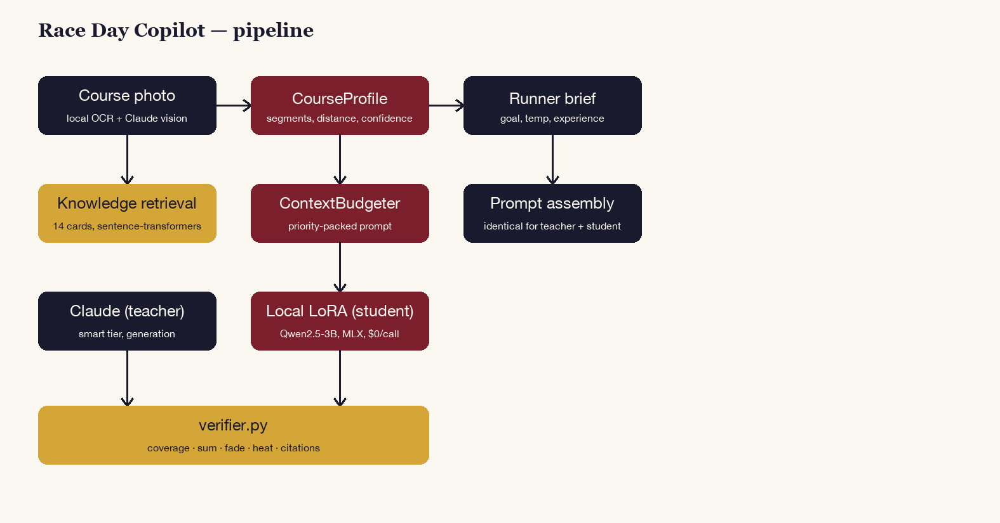

<p align="center">
  
</p>

# Race Day Copilot

Photograph a race course map — get a verified, km-by-km pacing plan that
accounts for hills, heat, and realistic fade, plus a **locally fine-tuned
model** distilled to produce the same plans without calling Claude.

## Why

Ask a chatbot for a marathon pacing plan and it will happily hand you a
plausible-looking table of splits that doesn't actually sum to your goal
time, ignores the course's hills, or quietly assumes a negative split
that 97.5% of runners never achieve. Race Day Copilot never trusts a
plan on vibes: every plan is checked in plain code against five
deterministic rules (coverage, arithmetic sum, per-km plausibility vs.
the course profile, fade direction, and a heat-adjustment formula derived
from a real Boston Marathon finding) before it's shown to you.

> 🌐 **Overview:** https://lyhjeremy.github.io/race-day-copilot/
> 📖 **Product overview:** https://lyhjeremy.github.io/race-day-copilot/overview/

## How it works

<p align="center">
  
</p>

- **Vision, entirely local.** No Gemini/OpenAI vision key required:
  local OCR + `claude -p` (Claude Max subscription, no per-token cost)
  reads a course-map photo into a structured `CourseProfile` (distance,
  hill segments, confidence) — refusing non-course photos.
- **Retrieval.** 14 knowledge cards (pacing research: negative-split
  rarity, hill-effort strategy, heat tax, hitting-the-wall decay) plus 4
  findings digests, embedded locally with `sentence-transformers`, packed
  into the prompt by a priority-based `ContextBudgeter` — the exact same
  prompt-assembly code is used for the Claude teacher and the local
  student, so neither ever gets a hint the other doesn't.
- **Grounded, verified generation.** Every plan is checked by
  [`verifier.py`](src/verifier.py) against five deterministic rules
  before it's ever shown: split coverage, arithmetic sum vs. the stated
  goal, per-km plausibility vs. the course's hill segments, fade
  direction/magnitude, and a heat-adjustment formula derived from
  [a real Boston Marathon finding](https://github.com/lyhjeremy/marathon-heat-tax)
  (~1 min slower per °F on the field median).
- **A locally fine-tuned distillation model.** A **Qwen2.5-3B model,
  LoRA fine-tuned on this laptop** on 1,458 teacher-generated,
  verifier-passed scenarios, producing the same pacing plans without a
  network call.

## The fine-tune, honestly benchmarked (and the training saga behind it)

Held-out benchmark (70 scenarios, split by scenario id, zero-shot/no-retry):

| System | Parse success | Verifier pass rate | Latency (s/plan) |
|---|---|---|---|
| Base Qwen2.5-3B (no fine-tune) | 55.7% | 0.0% | 17.5s |
| **+ LoRA (this project)** | **95.7%** | 0.0%* | 53.7s |
| Claude (teacher, zero-shot) | 90.0% | **75.7%** | 157.7s |

\* **Not a floor result — read the per-check breakdown.** LoRA achieves
near-parity with the teacher on structure, coverage, hill plausibility,
and the heat formula (all <5% failure). The real, well-understood
remaining gap is **exact split-time arithmetic** (82.9% of plans miss the
90-second sum tolerance) and a **self-consistency mismatch** in the
model's own `fade_allowance_pct` field vs. what its own splits compute
(91.4%) — a genuine LLM limitation with precise multi-step arithmetic,
not a bug. Full per-check table, judge results (teacher preferred in
93.3% of 60 blind pairwise comparisons, LoRA 0%, 6.7% tie — consistent
with the objective gap), and methodology in [`eval/benchmark.md`](eval/benchmark.md).

**This was the hardest fine-tune of the whole 5-project build.** Getting
here took four separate training attempts across two days: a spec-assumed
sequence length that was 2.7x too short (measured with the real
tokenizer, not guessed), a memory bug that silently produced fake
`0.000`-loss "training" that looked alive but wasn't, two loss-divergence
incidents (the second surviving longer after mitigation, but still
recurring), and finally a **custom training script built from scratch**
adding real gradient clipping — something `mlx_lm.lora`'s packaged CLI
doesn't expose at all. Even that didn't fully eliminate the instability;
the final published model is the best checkpoint from ~400 iterations of
confirmed-clean training, stopped deliberately rather than chased
further. Full blow-by-blow in [`writeup.md`](writeup.md).

## Guardrails

- **Deterministic verifier, not vibes** — 5 checks (coverage, sum, per-km
  plausibility, fade, heat), every violation a human-readable sentence
  fed back into a bounded retry loop.
- **Domain gate** — a non-course photo gets a friendly refusal, not a
  hallucinated route.
- **Identical prompt for teacher and student** — the benchmark compares
  what each system brings on its own, no schema hint given to one and
  not the other.
- **Context budget report** — every prompt's section-by-section token
  allocation is inspectable (`ContextBudgeter.pack().report`).

## Files

| File | Purpose |
|---|---|
| `app.py` | Gradio app (photo → brief → plan → verify → TTS) |
| `scripts/gen_scenarios.py` | Overnight resumable scenario generator (teacher + verifier) |
| `scripts/make_example_courses.py` | Hand-built `CourseProfile` fixtures (6 archetypes) |
| `training/prep_scenarios.py` | Scenario-id-split, leakage-checked dataset prep |
| `training/lora_harness/train_clipped.py` | Custom training script with real gradient clipping (`mlx_lm.lora`'s CLI has none) |
| `training/bench_copilot.py` | 3-way honest benchmark (base/LoRA/Claude) + blind pairwise judge |
| `src/verifier.py` | The five deterministic pacing-plan checks |
| `src/copilot.py` | Prompt assembly (identical for teacher + student) |
| `src/` | Vendored toolkit (llm, vision, guardrails, context, cache) |
| `eval/` | Benchmark results, loss curves, judge outputs, dataset card |

## Running it

```bash
pip install -r requirements.txt
python scripts/make_example_courses.py       # 6 course fixtures (committed)
python scripts/gen_scenarios.py              # scenario generation (overnight, resumable)
python training/prep_scenarios.py            # scenario-id-split train/valid/test
bash training/lora_harness/train_clipped.py --model mlx-community/Qwen2.5-3B-Instruct-4bit \
    --data data/lora --train --batch-size 1 --num-layers 16 --iters 1000 \
    --learning-rate 5e-5 --grad-accumulation-steps 4 --max-seq-length 4608 \
    --adapter-path training/adapters --grad-checkpoint --max-grad-norm 1.0
python app.py
```

No API key required — everything runs locally except a `claude -p` call
for course-photo extraction and generation (uses your Claude
subscription, not a metered API).

## License

MIT — see [`LICENSE`](LICENSE).
