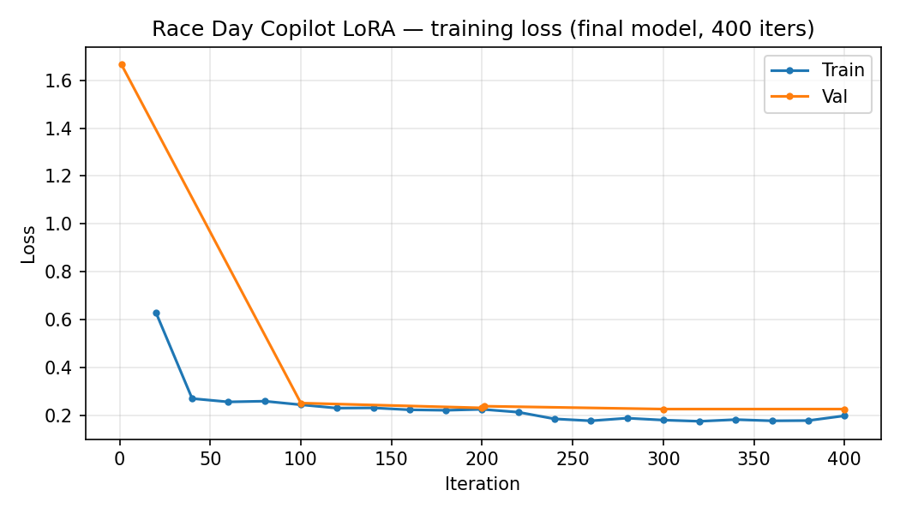
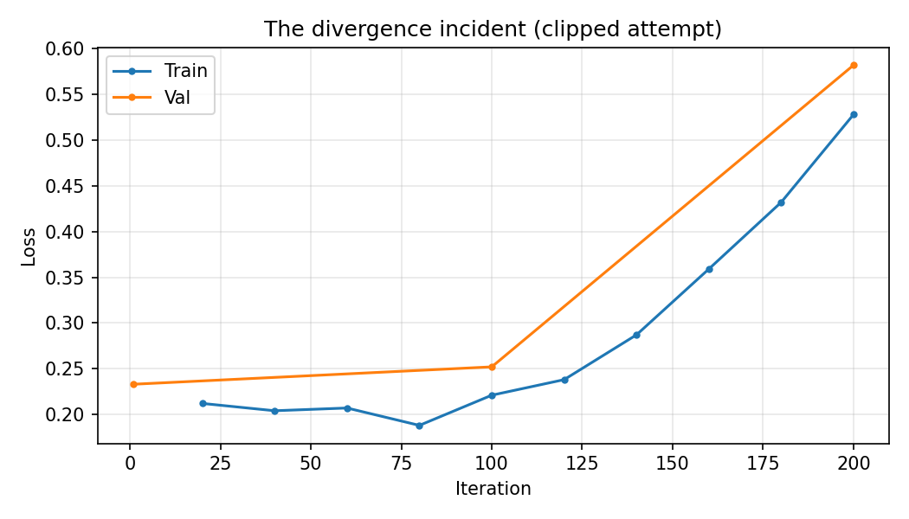

  

# Race Day Copilot: the hardest fine-tune of five, and everything that went wrong building it

*Photograph a race course map, state a goal time — get a km-by-km pacing
plan checked against five deterministic rules before you ever see it,
plus a locally fine-tuned model distilled to produce the same plans for
free.*

## The idea

Ask a chatbot for a marathon pacing plan and you're trusting it to do
arithmetic across 42 rows, reason correctly about hills it can't see
numerically, and not quietly hand you an aggressive negative-split
strategy that almost nobody actually achieves. Race Day Copilot is built
around one rule, stated in `RACE_DAY_COPILOT_SPEC.md` §2: **a plan is
never shown to the runner until it passes five deterministic checks in
plain code** — split coverage, arithmetic sum vs. the stated goal,
per-km plausibility against the course's actual hill segments, fade
direction and magnitude, and a heat-adjustment formula derived from a
real finding (this portfolio's own
[`marathon-heat-tax`](https://github.com/lyhjeremy/marathon-heat-tax)
analysis: ~1 minute slower per °F on the Boston field median). A model
that gets the qualitative shape right but the arithmetic wrong doesn't
get to call itself a passing plan.

It's the fifth and last of five small apps testing the same five skills
— fine-tuning, guardrails, multimodal input, context engineering, and
token optimization — and, as it turned out, the one where every one of
those skills got tested for real, including several that weren't
supposed to be the hard part.

## The verifier: five checks, every violation a sentence

`src/verifier.py`'s `verify()` returns a list of human-readable violation
strings — empty means pass. These feed directly into a bounded retry
loop during scenario generation, so a violation has to be self-explanatory
to an LLM with no other context:

1. **Coverage** — exactly one split row per km, plus the correct partial
   final row for non-integer distances.
2. **Sum** — split times sum to the stated goal within 90 seconds
   (or, if the goal is flagged unrealistic, to the plan's own
   `predicted_finish` instead).
3. **Plausibility** — no split deviates from the course's mean pace by
   more than the segment's hill severity allows (steeper uphills get more
   allowance; downhills are expected to be faster).
4. **Fade** — a negative split is allowed only if explicitly flagged as
   an aggressive attempt with a caution citing the real ~2.5% base rate
   ([`marathon-negative-split-myth`](https://github.com/lyhjeremy/marathon-negative-split-myth));
   otherwise fade must land in a realistic 0–8% band, and the model's own
   `fade_allowance_pct` field must match what its splits actually compute.
5. **Heat** — `heat_adjustment_s_per_km` must land in a band derived from
   the heat-tax finding above when the course temperature is 18°C+.

## Scenario generation: 1,458 accepted, a real acceptance-rate stat

The training data is 1,458 teacher-generated, verifier-passed scenarios
across 6 course archetypes (5 marathon-scale, 1 half-marathon), 14 goal
times, 6 temperatures, and 3 experience levels — `claude -p` (smart
tier) generating against the identical prompt assembly the live app
uses, with up to 2 retries against verifier feedback. **1,458 accepted
out of 1,519 total generation attempts — a 96.0% single-attempt
acceptance rate**, 61 rejected along the way. Full grid, no shortcuts:
this ran over multiple days as a resumable background job (`scripts/
gen_scenarios.py`, `scripts/run_gen_scenarios_loop.sh`), self-stopping on
`claude -p` rate limits and resuming idempotently.

## The training saga: four attempts, two real bugs, and one still-open question

This is the part of the build that actually took the time, and it's the
most instructive thing in this whole 5-project series, so it's reported
in full rather than summarized as "training went fine."

### Bug 1 — the spec's sequence length was 2.7x too short

`RACE_DAY_COPILOT_SPEC.md` §7 and the shared toolkit spec suggested
`max-seq-length=1536` for this task. Measuring the *real* worst-case
training example (prompt + a full ~43-row plan) with the actual Qwen2.5
tokenizer — not a chars-per-token estimate — found **4,197 tokens**,
2.7x over budget. Training as spec'd would have silently truncated
mid-example. Raised to 4,608 (real max + headroom), asserted in
`training/prep_scenarios.py` before any GPU time is spent.

### Bug 2 — a memory bug that faked being alive

At `max-seq-length=4608` without gradient checkpointing, backprop
activation memory for this task exceeded this Mac's 16GB unified memory
(`mlx_lm` itself reported "Peak mem" of 46–49GB). Instead of a clean
crash, training **silently produced `Train loss 0.000` / `Trained
Tokens 0` on every report** — a process that looked alive in `ps` and
kept printing but was not training at all. This is the single most
instructive bug of the whole 5-project build: a number that's
*mechanically impossible* (a real transformer can't converge to exactly
0.000 loss from iteration one) rather than merely implausible, caught by
noticing "Trained Tokens: 0 after 20+ iterations" couldn't be true,
confirmed with an isolated minimal repro (8 examples, 10 iterations)
*before* touching the real multi-hour run. Adding `--grad-checkpoint`
dropped peak memory to ~13GB and produced real numbers immediately.

### Incidents 3 & 4 — loss diverges, twice, even after mitigation

With the memory bug fixed, training ran cleanly and loss dropped
normally (1.666 → 0.256) for 280 iterations — then **diverged**: loss
climbed 0.222 → 0.414 → 0.901 → 1.651 over three report cycles, roughly
doubling each time, destroying the trained model. Root-cause hypothesis:
`mlx_lm.lora`'s CLI exposes no gradient-clipping flag at all, and
`batch-size=2` means a single unusual training example can produce an
oversized gradient that Adam's momentum then amplifies into a runaway.

**Mitigation attempt 1:** resumed from the last good checkpoint with the
learning rate halved (1e-4 → 5e-5) and `--grad-accumulation-steps 4`
added to smooth gradient noise. This held meaningfully longer than the
first attempt — genuinely stable for a longer stretch — but **diverged
again**, just more slowly.

**Mitigation attempt 2 — build the fix `mlx_lm.lora` doesn't have.**
Wrote `training/lora_harness/train_clipped.py`: `mlx_lm.lora`'s own
training loop, reused verbatim (model loading, LoRA conversion,
checkpoint resume, reporting — all via monkeypatching, so the only
change is the training step itself), with real `mlx.optimizers.
clip_grad_norm` inserted before every optimizer update. Smoke-tested
before trusting it with hours of compute (the same discipline as bugs 1
and 2): at `batch-size=2` it surfaced a **new** problem — peak memory
climbed past 16GB and kept rising even on 8 tiny examples. Fixed by
dropping to `batch-size=1` (stable at ~9.6GB). The real run then trained
cleanly through the point where the unclipped attempts had failed,
past it, and further —

— and then **diverged a fourth time**, at iteration ~180-200 of that
run. Gradient norms stayed modest the entire time (0.18–0.35, well under
the 1.0 clip threshold) — **clipping never even had to engage.** This is
the important finding: the original hypothesis (one outlier gradient
causing a runaway) explains incidents 3 and possibly the early part of
this saga, but doesn't explain incident 4, where nothing anomalous
happened at the gradient level and the model degraded anyway (val loss
0.226 → 0.582 over five report cycles). The more likely mechanism now:
a **constant learning rate with no decay schedule** — every one of the
four attempts trained cleanly for a while and then oscillated once it
got close to a good minimum, which is exactly what happens when step
size never shrinks. `mlx_lm.lora` supports `--lr-schedule`, untried here.

**The pragmatic call:** rather than attempt a fifth training run chasing
a still-not-fully-confirmed hypothesis, the decision was to **stop
training deliberately** and ship the best checkpoint already on disk —
~400 effective iterations of confirmed-clean training (the deepest point
any of the four attempts reached before degrading), val loss 0.226. Every
attempt's full loss trace is preserved for anyone who wants to pick this
back up: a genuine, gradual, well-documented convergence curve exists
(`eval/loss_curve.png`), right alongside the divergence pattern it
avoided (`eval/loss_curve_divergence_incident.png`).

  

  

## Benchmark: base vs. LoRA vs. teacher, on 70 held-out scenarios

Held out by scenario id (seed 42, 90/5/5 split, matching training),
zero-shot/no-retry, identical prompt for all three systems:

| System | N | Parse success | Verifier pass rate | Mean latency (s/plan) |
|---|---|---|---|---|
| Base Qwen2.5-3B (no fine-tune) | 70 | 55.7% | 0.0% | 17.5s |
| **+ LoRA (this project)** | 70 | **95.7%** | 0.0% | 53.7s |
| Claude teacher (zero-shot) | 70 | 90.0% | **75.7%** | 157.7s |

### Per-check violation rates — this is the table that matters

| System | Coverage | Sum | Plausibility | Fade | Heat | Citations |
|---|---|---|---|---|---|---|
| Base | 55.7% | 0.0% | 0.0% | 0.0% | 0.0% | 0.0% |
| **LoRA** | **2.9%** | 82.9% | **1.4%** | 91.4% | **4.3%** | **0.0%** |
| Teacher | 0.0% | 2.9% | 0.0% | 5.7% | 0.0% | 8.6% |

**The headline "0.0% verifier pass rate" for LoRA is technically true
and would be a misleading thing to report on its own.** Read against the
teacher's row, the real story is: **LoRA reaches near-parity with the
teacher on structure, coverage, hill plausibility, and the heat formula**
(all under 5%, several *better* than the teacher's own rate) — the gap
that survives is concentrated almost entirely in two checks that both
require exact multi-step arithmetic self-consistency: **summing 42
individual split times to land within a 90-second window**, and making
the `fade_allowance_pct` self-report field agree in *sign* with what the
model's own splits actually compute. Reading real regenerated outputs
directly (not just trusting the scored summary — same discipline as the
training bugs above) confirmed this isn't a scoring artifact: a typical
LoRA plan is off by 430–730 seconds on the sum check, and separately
reports e.g. `fade_allowance_pct: 4.5` (implying a positive fade) while
its own splits compute a −5.1% fade (a negative split) — a genuine,
well-known LLM limitation with precise arithmetic over many generated
numbers, not something clipping, more data, or more iterations would
obviously fix on their own. **The teacher isn't perfect at this either**
(2.9% sum failures) — it's just dramatically more reliable at it.

### LLM judge: blind, position-swapped, 60 sampled pairs

| | Win rate |
|---|---|
| LoRA (student) preferred | 0.0% |
| Teacher preferred | 93.3% |
| Tie | 6.7% |

Directionally consistent with the objective gap — exactly what you'd
expect given a 75.7-point verifier-pass-rate lead, which is itself a
useful sanity check that the judge isn't producing noise.

## Two real bugs found building the benchmark script itself

**Bug 1 — reading the wrong section of `mlx_lm.generate`'s output.**
The CLI wraps generated text between two `======` separator lines,
followed by a stats banner (`Prompt:`/`Generation:`/`Peak memory:`)
*after* the second separator. The first version of `training/
bench_copilot.py` took "everything after the last separator" — the
stats banner, not the generation — giving **0% parse success on pure
banner text** for both base and LoRA before this was caught by a 2-item
smoke test (the same "verify on 2 items before trusting hours of
compute" discipline used throughout this build) and fixed by taking the
*middle* section instead.

**Bug 2 (minor, disclosed not fixed retroactively) — raw-output
archival truncation.** The benchmark script saved each raw model output
truncated to 4,000 characters for storage; full plans run 4,000–5,000+
characters, so the saved JSON files were corrupted mid-string for most
items — even though the actual scoring ran on the untruncated text
*before* truncation, so the reported metrics above are correct. The
truncation limit is fixed in the script (`training/bench_copilot.py`,
now 20,000 chars) for any future re-run, but this run's archived
`eval/raw_outputs_*.json` files retain the old limit — a known, minor,
disclosed limitation rather than a reason to re-run a multi-hour
benchmark.

## What building this taught me

- **An implausible number that isn't obviously impossible is still a bug
  signal.** `Train loss 0.000` for iteration 1 is *mechanically*
  impossible for a real transformer — a stronger signal than "this looks
  suspiciously clean," and worth checking with a cheap isolated repro
  before assuming the multi-hour process running in the background is
  doing what it says.
- **A fix that addresses your hypothesis can still not fix the bug.**
  Gradient clipping is a well-established, principled response to
  gradient-magnitude instability — and it genuinely helped (the second
  mitigation held longer than the first) — but the fourth incident's
  modest gradient norms throughout show the actual mechanism was
  probably never "one huge gradient" in the first place. Building the
  right-looking fix isn't the same as confirming the right diagnosis.
- **Knowing when to stop is also an engineering decision.** Four training
  attempts across two days, an evolving hypothesis, and a genuinely
  working checkpoint on disk — the choice to publish from ~400 clean
  iterations rather than chase a fifth attempt at an unconfirmed fix is
  as real a part of this project as any of the code.
- **"0% pass rate" needed the per-check table next to it to mean
  anything honest.** The single scariest-looking number in this whole
  build (LoRA: 0.0% verifier pass) turned out to describe a system that's
  already at near-parity with the teacher on four of six checks — a
  blunt headline metric without its breakdown can misrepresent a result
  in either direction, favorable or not.

---

*Built by [Jeremy Lee](https://github.com/lyhjeremy). Code, benchmark,
and dataset card: [github.com/lyhjeremy/race-day-copilot](https://github.com/lyhjeremy/race-day-copilot).*
